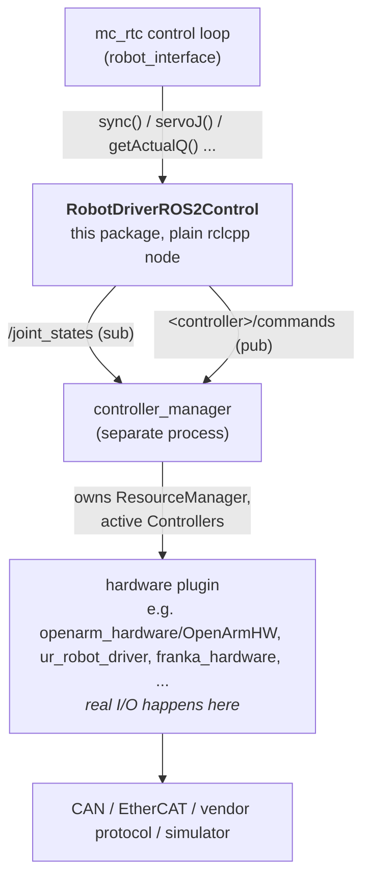

# ros2_control_driver

A `robot_interface` driver plugin that bridges mc_rtc to **any** robot
already running under a standard [ros2_control](https://control.ros.org/jazzy/index.html)
`controller_manager`: UR, Franka, OpenArm, a custom arm, a simulated one via
`mujoco_ros2_control` / `gz_ros2_control`, etc.

## Design

This driver is a **plain ROS 2 node/client**, not a hardware plugin and not
an embedded `ResourceManager`. `controller_manager` runs as its own separate
process (started the normal ros2_control way, e.g. the robot vendor's own
launch file), and owns everything below it: the `ResourceManager`, the
loaded hardware plugin (which is where the real CAN/EtherCAT/etc.
communication happens), and the active `Controller` plugins
(`joint_state_broadcaster`, `forward_command_controller`).

This driver only:

- subscribes to `joint_state_broadcaster`'s `/joint_states` topic for
  `getActualQ()` / `getActualQd()` / `getJointTorques()`
- publishes `std_msgs/Float64MultiArray` to a
  `forward_command_controller`'s `<controller>/commands`
  topic for `servoJ()` / `speedJ()` / `tauJ()`
- optionally checks, at startup, that the controllers it depends on are
  `active` via `controller_manager_msgs/ListControllers` (the same service
  `ros2 control list_controllers` uses)



Joint names and which command interface exists are entirely config- and
`controller_manager`-YAML-driven. Adding a new robot means writing its
`<ros2_control>` URDF tag, its `controller_manager` YAML (hardware plugin +
`forward_command_controller`(s) + `joint_state_broadcaster`), and this
package's `etc/ros2_control/ros2_control.yaml`, never touching
`RobotDriverROS2Control.cpp`.

## Worked example: OpenArm

[OpenArm](https://docs.openarm.dev/1.0/software/ros2/control/)'s own
[`openarm_bimanual_controllers.yaml`](https://github.com/enactic/openarm_ros2/blob/main/openarm_bringup/config/controllers/openarm_bimanual_controllers.yaml)
is exactly this shape: `joint_state_broadcaster` +
`left/right_forward_position_controller` +
`left/right_forward_velocity_controller` (all
`forward_command_controller/ForwardCommandController`, differing only in
`interface_name`) + `left/right_joint_trajectory_controller` for the
non-mc_rtc use case. Its
[`<ros2_control>` xacro](https://github.com/enactic/openarm_description/blob/main/assets/robot/openarm_v1.0/urdf/ros2_control/openarm.ros2_control.xacro)
declares 7 joints per arm (`openarm_{left,right}_joint1..7`, plus an optional
`..._finger_joint1` gripper joint) via the
[`openarm_hardware/OpenArmHW`](https://github.com/enactic/openarm_ros2/tree/main/openarm_hardware)
hardware plugin (CAN bus underneath).

Since OpenArm bimanual is two independent arms under one
`controller_manager`, model it as **two mc_rtc robots**
(`openarm_left`/`openarm_right`), each with its own `RobotDriverROS2Control`
instance/config pointed at that same running `controller_manager`'s
`left_*`/`right_*` controller topics, sharing the one `/joint_states` topic.
See the commented-out block at the bottom of
[`etc/ros2_control/ros2_control.yaml`](etc/ros2_control/ros2_control.yaml) for the filled-in `openarm_left`
config. No changes needed to `RobotDriverROS2Control.cpp`, just a different config.

## Worked example: UR5e (Gazebo sim)

[`ur_simulation_gz`](https://github.com/UniversalRobots/Universal_Robots_ROS2_GZ_Simulation)
brings up a UR5e in Gazebo behind a standard `controller_manager`, the same
shape as a real UR:

```bash
source ~/ur_ws/install/setup.bash
ros2 launch ur_simulation_gz ur_sim_control.launch.py ur_type:=ur5e
```

It starts with `joint_trajectory_controller` active, so switch to
`forward_position_controller` first (see "Switching which controller is
active" above), then point `RobotDriverROS2Control` at
[`etc/ros2_control/ur5e.yaml`](etc/ros2_control/ur5e.yaml) — no `RobotDriverROS2Control.cpp` changes
needed here either.

## Config

Requires a sourced ROS 2 workspace (`source /opt/ros/<distro>/setup.bash`)
so `rclcpp`/`std_msgs`/`sensor_msgs`/`controller_manager_msgs` CMake configs
are discoverable, and `controller_manager` already running for the target
robot before `robot_interface` loads this driver.

`config_path` in the driver's `mc_rtc.yaml` entry holds the path to a small
YAML describing this robot's ros2_control topics, see
[`etc/robot_interface.yaml`](etc/robot_interface.yaml) and
[`etc/ros2_control/ros2_control.yaml`](etc/ros2_control/ros2_control.yaml) for the schema.
`RobotInterface::loadDriver()` passes `(name, ip, port, config_path)` to
every driver's `create()`; this driver ignores `ip`/`port` and only reads
`config_path`.

Only one command topic (`position_command_topic` / `velocity_command_topic` /
`effort_command_topic`) needs to be set per robot, whichever matches that
robot's `controller.mode` in `mc_rtc.yaml`. Switching modes at runtime would
require calling `controller_manager`'s `/switch_controller` service to
activate a different `forward_command_controller`, which this driver doesn't
do today (not needed while `controller.mode` is fixed per robot at startup).

## Switching which controller is active on `controller_manager`

This driver only ever *talks to* whatever controller is currently active.
It doesn't load, activate, or switch controllers itself. Only one controller
can claim a given joint's command interface at a time, so to point this
driver's config at a different controller you first need to free that
interface on the `controller_manager` side. All of this is plain
`ros2 control` CLI, done once before starting `robot_interface` (source your
ROS 2 workspace first):

```bash
# 1. See what's currently loaded and active
ros2 control list_controllers

# 2. Deactivate whatever currently claims the command interface(s) you need
ros2 control switch_controllers \
  --deactivate left_joint_trajectory_controller right_joint_trajectory_controller \
  --strict

# 3a. If the target controller is declared in controller_manager's params but
#     not yet loaded (check with `ros2 param get /controller_manager <name>.type`):
ros2 control load_controller left_forward_position_controller --set-state active

# 3b. If it's already loaded, just inactive, do both steps in one strict switch:
ros2 control switch_controllers \
  --deactivate left_joint_trajectory_controller \
  --activate left_forward_position_controller \
  --strict
```

`--strict` makes the switch fail atomically (nothing changes) if any
requested controller can't be found or switched, rather than partially
applying it. This is exactly the sequence used to move the OpenArm bimanual
sim from `joint_trajectory_controller` to `forward_command_controller`
(`forward_position_controller`) for use with this driver's
`position_command_topics`. Just repeat the deactivate/load-or-switch steps
for the `right_*` controller too.

## Docker

The [`Dockerfile`](Dockerfile) builds this driver on top of the published
`ghcr.io/isri-aist/unified_robot_interface` image (ROS Jazzy, mc_rtc, zenoh and
URI preinstalled). CI publishes the result as
`ghcr.io/isri-aist/ros2_control_driver`, which [`compose.yaml`](compose.yaml)
runs:

```bash
docker compose up            # pulls the published image
docker compose pull          # updates it to the latest main
docker compose up --build    # builds it locally instead
```

Configs are read from `./etc`, mounted on `/config`, so `config_path` in
`robot_interface.yaml` must point inside it (e.g.
`/config/ros2_control/ur5e.yaml`).

Environment variables, read from the shell or a `.env` file:

| Variable | Default | Meaning |
|---|---|---|
| `URI_CONFIG_DIR` | `./etc` | Host directory mounted on `/config` |
| `URI_CONFIG_FILE` | `robot_interface.yaml` | File in it passed to `uri interface -c` |
| `ROS_DOMAIN_ID` | `0` | Must match the `controller_manager` side |
| `RMW_IMPLEMENTATION` | `rmw_fastrtps_cpp` | `rmw_fastrtps_cpp` or `rmw_cyclonedds_cpp` |
| `ROS2_CONTROL_DRIVER_IMAGE` | `ghcr.io/isri-aist/ros2_control_driver:latest` | Image to run (e.g. pin a `:<commit sha>` tag) |
| `BASE_IMAGE` | `ghcr.io/isri-aist/unified_robot_interface:latest` | URI image to build on (with `--build`) |
